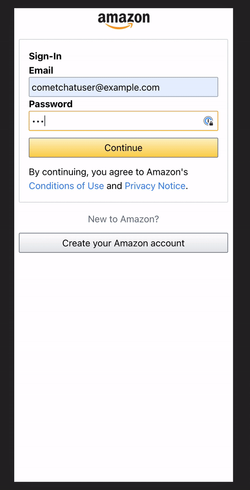

# Marketplace Site With React and Real-time Chat (Amazon Clone)

Read the full tutorial here:

[**>> How to Build a Marketplace Site With React (Amazon Clone)**](https://www.cometchat.com/tutorials/build-a-modern-android-chat-app-with-kotlin/?utm_source=github&utm_medium=link&utm_campaign=igorasilveira-marketplace-cometchat)

This example shows how to build an marketplace like Amazon where you can chat with the product's seller to answer your queries:

## Technology
This demo uses:

* NodeJS `version >=12`
* [Firebase](https://firebase.google.com/) 🔥
* JavaScript 💛
* [Create-react-app](https://create-react-app.dev/) ⚛
* [TailwindCSS](https://tailwindcss.com/) 🍃
* [CometChat](https://www.cometchat.com/) 🚀

## Running the demo

To run the demo follow these steps:

1. [Head to CometChat Pro and create an account](https://www.cometchat.com/pro?utm_source=github&utm_medium=link&utm_campaign=igorasilveira-marketplace-cometchat)
2. From the [dashboard](https://app.cometchat.com/signup?utm_source=github&utm_medium=link&utm_campaign=igorasilveira-marketplace-cometchat), create a new app called "Marketplace Chat"
3. Once created, click **Explore**
4. Go to the **API Keys** tab and click **Create API Key**
5. Create an API key called "Marketplace Chat Key" with **Full Access**
4. Clone the repository by running `git clone git@github.com:igorasilveira/marketplace-cometchat.git` and open it in your editor of choice.
5. Copy the [`.env.example`](https://github.com/igorasilveira/marketplace-cometchat/blob/main/.env.example) and rename it to `.env` and update the COMETCHAT related variables with your `appId`, `authKey` and `region`.
6. Run `npm install` on the root of the project to install dependencies.
7. Run `npm start` to run you application locally.
8. Start registering users and creating products!

Questions about running the demo? [Open an issue](https://github.com/igorasilveira/marketplace-cometchat/issues). We're here to help ✌️

## Useful links

- 🏠 [CometChat Homepage](https://www.cometchat.com/pro/?utm_source=github&utm_medium=link&utm_campaign=igorasilveira-marketplace-cometchat)
- 🚀 [Create your free account](https://app.cometchat.com/signup/?utm_source=github&utm_medium=link&utm_campaign=igorasilveira-marketplace-cometchat)
- 📚 [Documentation](https://prodocs.cometchat.com/?utm_source=github&utm_medium=link&utm_campaign=igorasilveira-marketplace-cometchat)
- 👾 [GitHub](https://github.com/igorasilveira/marketplace-cometchat)
